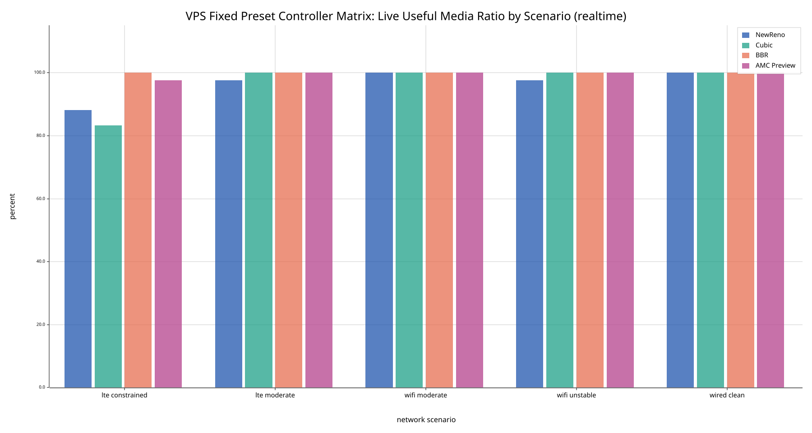
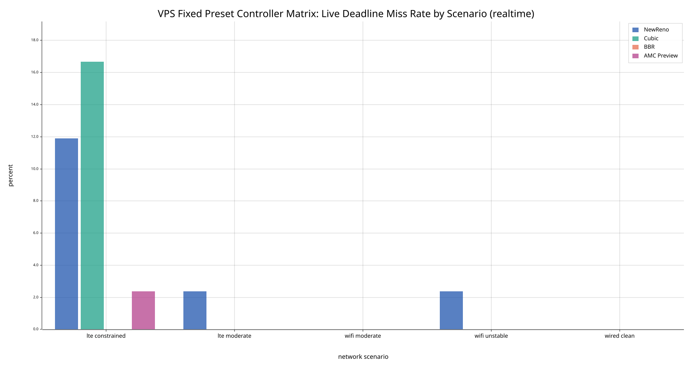
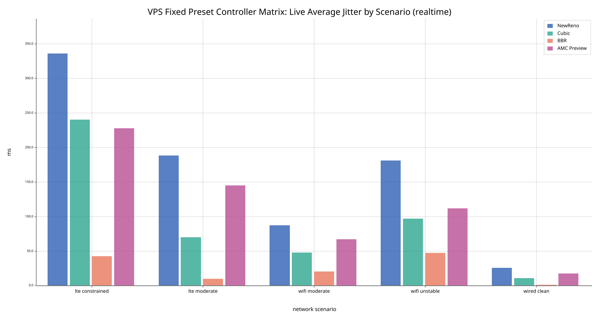
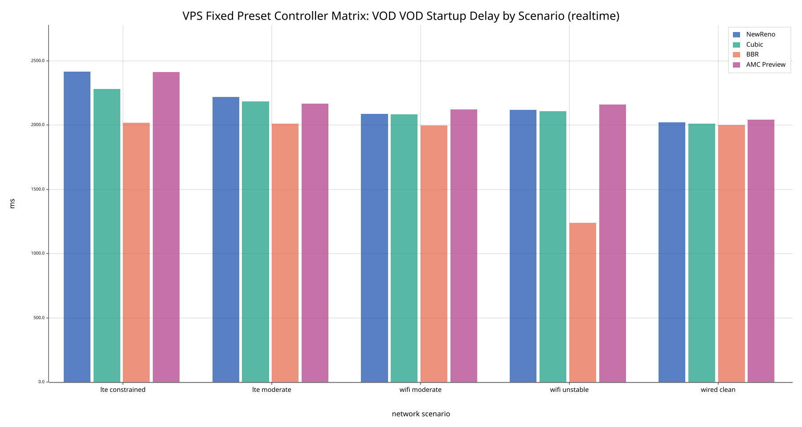
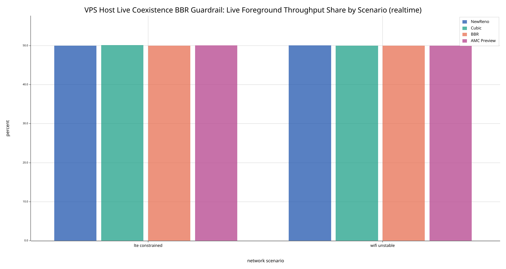
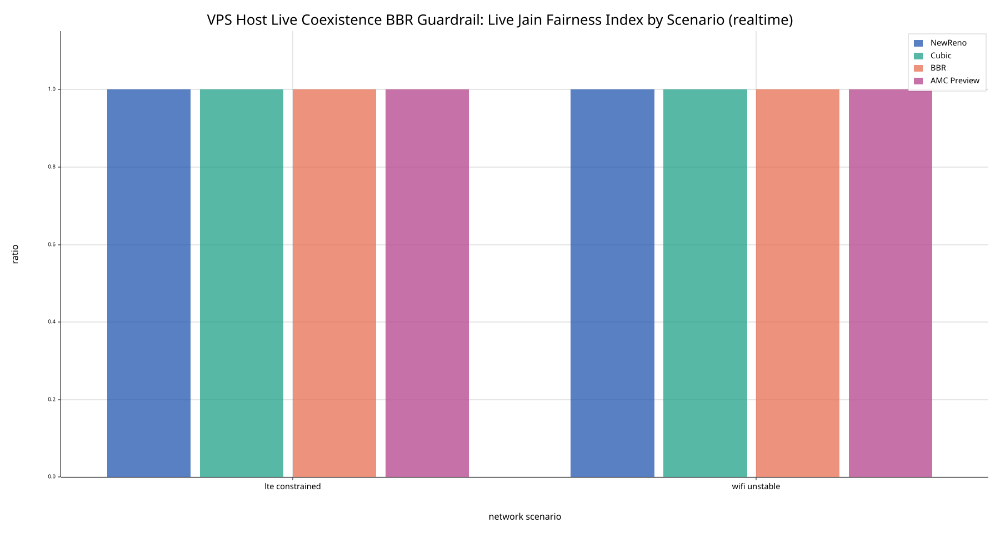

# Semantic-Aware Multimedia Congestion Control on Quinn

Grounded repository report for `quinn-amc`.

This bundle is designed to be handed to a writer directly. It contains:

- this standalone Markdown report
- copied figure assets under `figures/`
- copied code snippets under `snippets/`
- copied source documents and processed comparison exports under `sources/`

## Scope and Claim Boundary

This repository is complete at the AMC v1 boundary, not at a broader AMC v2 or BBR-replacement boundary.

The narrow claim supported by the repository's frozen evidence is:

- AMC v1 improves the hardest constrained live cells relative to `new_reno` and `cubic`
- BBR remains the strongest overall live baseline across the canonical fixed matrix
- VOD is required supporting evidence, but AMC v1 is not a startup-delay winner
- fairness is required and is interpreted at the throughput-sharing level against BBR, not as proof of application-quality parity under competition

Those boundaries come from the repository's current operator and methodology documents, copied into this bundle under `sources/README.md`, `sources/methodology.md`, and `sources/final-report.md`.

## Project Structure

The workspace is a Rust Cargo multi-crate research artifact:

- `crates/amc-core`: semantic scoring and AMC congestion-control logic
- `crates/demo-client`: replay-driven sender that derives semantics and updates the controller runtime signal
- `crates/demo-server`: receiver and report sink
- `crates/harness`: suite execution, analysis, plotting, packaging, and live demo

The runtime is trace-driven rather than stack-driven. Media is preprocessed offline into manifests and segments under `data/processed/`, and runtime experiments consume those prepared assets rather than a full streaming stack.

## System Model

The sender-visible semantic interface is codec-agnostic. The relevant inputs are:

- traffic class: `vod` or `live`
- importance: `background`, `normal`, `high`, `critical`
- dependency depth
- delivery deadline
- freshness window
- payload size

The sender-to-controller path is intentionally narrow:

1. the replay sender derives a semantic profile for each segment from manifest hints and defaults
2. the sender converts that profile into a scalar runtime utility signal
3. the Quinn congestion controller samples only the latest connection-wide signal

This is a deliberate AMC v1 boundary. The controller does not consume per-stream state, per-packet semantic annotations, or a history of utility changes.

## AMC v1 Controller Design

### Semantic Inputs

The data model is defined in `crates/amc-core/src/semantics.rs`. The demo client computes queue delay as sender elapsed time minus segment start time, derives a deadline budget from the configured deadline and segment duration, chooses a default freshness window of the full deadline for VOD or one segment duration for live traffic, and computes a `dependency_ready` flag before updating the shared runtime state.

### Utility Scoring

The scoring law implemented by `DefaultUtilityScorer` in `crates/amc-core/src/policy.rs` is multiplicative:

$$
\text{score} = \frac{w_{importance} \cdot w_{traffic} \cdot p_{depth} \cdot p_{dependency} \cdot p_{deadline} \cdot p_{freshness}}{\sqrt{size\_bytes}}
$$

The concrete factors in the code are:

- importance weights: background `0.25`, normal `1.0`, high `2.0`, critical `4.0`
- traffic weight: VOD `1.0`, live `1.25`
- dependency-depth penalty: `1 / (1 + depth)`
- dependency penalty: `1.0` when ready, `0.2` otherwise
- deadline and freshness penalties: linear remaining-budget ratios, forced to zero once the corresponding limit is exceeded
- size penalty: `sqrt(size_bytes)`

Copied source snippet: `snippets/utility_scoring_core.rs`

```rust
let importance_weight = match inputs.semantics.importance {
    Importance::Background => 0.25,
    Importance::Normal => 1.0,
    Importance::High => 2.0,
    Importance::Critical => 4.0,
};

let traffic_weight = match inputs.semantics.traffic_class {
    TrafficClass::Vod => 1.0,
    TrafficClass::Live => 1.25,
};

let dependency_depth_penalty = 1.0 / (1.0 + f64::from(inputs.semantics.dependency_depth.0));
let dependency_penalty = if inputs.dependency_ready { 1.0 } else { 0.2 };

UtilityScore(
    (importance_weight
        * traffic_weight
        * dependency_depth_penalty
        * dependency_penalty
        * deadline_penalty
        * freshness_penalty)
        / size_penalty,
)
```

Two tests in the same file define controller intent clearly: expired units score zero, and deeper dependencies score lower than independent units.

### Signal Mapping and Runtime Smoothing

AMC v1 does not feed the raw utility score directly into the congestion window. The score is mapped into:

- an ACK growth gain
- a loss reduction factor

The mapping is traffic-class specific. The code normalizes the score using a stronger mapping for live traffic than for VOD, then derives a more aggressive live ACK gain and live loss response. The runtime signal is also smoothed: `UTILITY_SIGNAL_EWMA_WEIGHT` is set to `0.35`, so the controller consumes an EWMA-smoothed connection-wide utility signal instead of raw per-send observations.

### Congestion-Window Control Law

The controller is implemented through Quinn's public congestion-controller interface rather than a Quinn fork. In `crates/demo-client/src/lib.rs`, the baseline controllers map to Quinn's built-in BBR, Cubic, and NewReno configs, while `amc_preview` maps to `AmcControllerConfig`.

The AMC controller in `crates/amc-core/src/policy.rs` is cwnd-based and uses these default datagram limits:

- initial window: `20` datagrams
- minimum window: `4` datagrams
- maximum window: `400` datagrams

It also uses an asymmetric class cap:

- VOD is capped at half the global maximum window
- live traffic may use the full maximum window

On ACK, the controller increases cwnd by a utility-weighted growth step and clamps it between the minimum window and the class-specific maximum. On loss, it multiplies the window by the utility-derived loss reduction factor and clamps the result. Persistent congestion forces the window back to the minimum.

Copied source snippet: `snippets/amc_window_update.rs`

```rust
fn on_end_acks(
    &mut self,
    _now: Instant,
    _in_flight: u64,
    app_limited: bool,
    largest_packet_num_acked: Option<u64>,
) {
    if app_limited || largest_packet_num_acked.is_none() {
        return;
    }

    let signal = self.runtime_state.snapshot();
    let growth = self.growth_step(signal);
    self.window =
        (self.window + growth).clamp(self.min_window(), self.class_max_window(signal));
    self.publish_controller_snapshot(AmcControllerEvent::Ack, None);
}

fn on_congestion_event(
    &mut self,
    now: Instant,
    sent: Instant,
    is_persistent_congestion: bool,
    _lost_bytes: u64,
) {
    if sent <= self.recovery_start_time {
        return;
    }

    self.recovery_start_time = now;
    let signal = self.runtime_state.snapshot();
    self.window = ((self.window as f64) * signal.loss_reduction_factor).round() as u64;
    self.window = self.window.max(self.min_window());
    self.window = self.window.min(self.class_max_window(signal));
    self.ssthresh = self.window;

    if is_persistent_congestion {
        self.window = self.min_window();
    }
}
```

The controller is therefore a conventional connection-wide congestion controller whose growth and backoff are modulated by a semantic utility signal.

## Canonical Methodology and Evidence Contract

The frozen benchmark surface is:

- workloads: `vod`, `live`
- controllers: `new_reno`, `cubic`, `bbr`, `amc_preview`
- presets: `wired_clean`, `wifi_moderate`, `wifi_unstable`, `lte_moderate`, `lte_constrained`

The final evidence comes from exactly two canonical VPS suites:

- `configs/harness/vps_fixed_preset_controller_matrix.json`
- `configs/harness/vps_host_live_coexistence_bbr_guardrail.json`

The workflow is intentionally split:

- the fixed matrix runs through `scripts/experiments/run_linux_vps_suite.sh` with host-managed `tc` on the demo-server container host-veth
- the fairness guardrail runs directly through the host `harness` binary with `tc` on `lo`

That split is part of the frozen methodology, not an accidental workflow gap.

The canonical processed artifacts copied into `sources/` are:

- `sources/vps_fixed_preset_controller_matrix_comparison.json`
- `sources/vps_host_live_coexistence_bbr_guardrail_comparison.json`

The current methodology also fixes the evidence completeness claims:

- fixed matrix: `10 / 10` complete matrix groups
- fairness guardrail: `2 / 2` complete fairness groups

Representative figure assets copied into this bundle are:

- `figures/vps_fixed_preset_controller_matrix_live_realtime_useful_media_ratio.svg`
- `figures/vps_fixed_preset_controller_matrix_live_realtime_deadline_miss_rate.svg`
- `figures/vps_fixed_preset_controller_matrix_live_realtime_average_jitter_ms.svg`
- `figures/vps_fixed_preset_controller_matrix_vod_realtime_vod_startup_delay_ms.svg`
- `figures/vps_host_live_coexistence_bbr_guardrail_live_realtime_fairness_foreground_throughput_share.svg`
- `figures/vps_host_live_coexistence_bbr_guardrail_live_realtime_fairness_jain_index.svg`

## Results

### Live Single-Flow Matrix

`wifi_unstable` is the cleanest bounded success case for AMC v1.

| Controller | Useful ratio | Miss rate | Avg. latency (ms) | Avg. AoI (ms) |
| --- | ---: | ---: | ---: | ---: |
| AMC preview | 1.0000 | 0.0000 | 140.14 | 141.10 |
| BBR | 1.0000 | 0.0000 | 53.64 | 54.00 |
| Cubic | 1.0000 | 0.0000 | 85.24 | 85.86 |
| NewReno | 0.9762 | 0.0238 | 176.36 | 176.67 |

Interpretation:

- AMC matches BBR on useful-media ratio and deadline-miss rate in this cell
- AMC avoids the deadline misses that `new_reno` still incurs
- BBR still wins clearly on latency and AoI, so this is not a broad BBR-parity claim

Representative figures:







`lte_constrained` remains the hardest live cell.

| Controller | Useful ratio | Miss rate | Avg. latency (ms) | Avg. AoI (ms) | Avg. jitter (ms) |
| --- | ---: | ---: | ---: | ---: | ---: |
| AMC preview | 0.9762 | 0.0238 | 242.76 | 243.64 | 227.88 |
| BBR | 1.0000 | 0.0000 | 33.79 | 34.07 | 42.51 |
| Cubic | 0.8333 | 0.1667 | 341.05 | 341.24 | 240.61 |
| NewReno | 0.8810 | 0.1190 | 448.81 | 449.26 | 336.02 |

Interpretation:

- AMC improves substantially over `cubic` and `new_reno` on useful delivery and deadline misses
- AMC still trails BBR materially on latency, age of information, and jitter
- the strongest grounded headline is constrained-live improvement over the loss-based baselines, not broad superiority across the matrix

### VOD Supporting Evidence

VOD remains supporting evidence rather than the main AMC success surface. Across the constrained VOD cells used in the frozen report narrative, all controllers preserve continuity, but AMC does not win startup delay.

| Controller | `wifi_unstable` startup (ms) | `lte_constrained` startup (ms) |
| --- | ---: | ---: |
| AMC preview | 2160 | 2412 |
| BBR | 1239 | 2018 |
| Cubic | 2109 | 2282 |
| NewReno | 2120 | 2416 |

Additional VOD continuity facts from the processed comparison export:

- all four controllers retain useful ratio `1.0` on the cited constrained VOD presets
- all four controllers retain rebuffer ratio `0.0` on those same presets

Representative figure:



The correct VOD interpretation is limited: AMC v1 preserves continuity, but the processed comparisons do not support a claim that it is startup-delay competitive.

### Fairness Guardrail

The coexistence guardrail validates fairness against BBR at the throughput-sharing level.

| Scenario | Controller | Foreground share | Throughput ratio | Jain index |
| --- | --- | ---: | ---: | ---: |
| `wifi_unstable` | AMC preview | 0.4998 | 0.9994 | 0.9999999 |
| `wifi_unstable` | BBR | 0.4999 | 0.9997 | 0.99999998 |
| `lte_constrained` | AMC preview | 0.5002 | 1.0009 | 0.9999998 |
| `lte_constrained` | BBR | 0.5001 | 1.0005 | 0.9999999 |

Representative figures:





Interpretation:

- foreground throughput share stays effectively centered at `0.5`
- Jain fairness stays effectively `1.0`
- AMC does not obtain its bounded live improvements by seizing an unfair throughput share from a competing BBR flow

This remains a narrow fairness claim. Throughput fairness against BBR does not imply freshness parity with BBR under competition on the hardest constrained live path.

## Reproducibility

Canonical VPS rerun commands from the repository documentation:

```bash
cd /home/leven/quinn-amc
sudo bash scripts/experiments/run_linux_vps_suite.sh configs/harness/vps_fixed_preset_controller_matrix.json
source "$HOME/.cargo/env"
cargo build -p harness
sudo ./target/debug/harness run-suite --config configs/harness/vps_host_live_coexistence_bbr_guardrail.json
sudo chown -R "$USER":"$USER" results/vps
```

Canonical figure regeneration commands:

```powershell
cargo run -p harness -- plot-suite --comparison results/vps/processed/harness/vps_fixed_preset_controller_matrix_comparison.json --output-dir results/vps/figures/harness
cargo run -p harness -- plot-suite --comparison results/vps/processed/harness/vps_host_live_coexistence_bbr_guardrail_comparison.json --output-dir results/vps/figures/harness
```

Canonical report-package command:

```powershell
cargo run -p harness -- package-report --report docs/final-report.md --matrix-comparison results/vps/processed/harness/vps_fixed_preset_controller_matrix_comparison.json --fairness-comparison results/vps/processed/harness/vps_host_live_coexistence_bbr_guardrail_comparison.json --figure-dir results/vps/figures/harness --output-dir results/vps/reports/final
```

## Limitations

The repository's current evidence does not support these stronger claims:

- broad superiority over BBR
- AMC v2 controller-state expansion
- docker-runner coexistence parity
- QUIC datagrams in the primary evaluation claim
- a claim that AMC is VOD-startup competitive

Those limits are not soft caveats. They are part of the repository's explicit methodology and completion boundary.

## Grounding Map

This report is grounded in the following copied sources inside the bundle:

- `sources/README.md`
- `sources/methodology.md`
- `sources/final-report.md`
- `sources/result-schema.md`
- `sources/vps_fixed_preset_controller_matrix_comparison.json`
- `sources/vps_host_live_coexistence_bbr_guardrail_comparison.json`

Code excerpts are copied under:

- `snippets/utility_scoring_core.rs`
- `snippets/amc_window_update.rs`

## Conclusion

`quinn-amc` presents a disciplined AMC v1 result rather than a sweeping transport claim. Its implementation takes semantic hints from replay manifests, collapses them into an EWMA-smoothed connection-wide utility signal, and modulates cwnd growth and loss backoff through Quinn's public controller interface. The frozen VPS evidence supports a narrow but real outcome: in the hardest constrained live cells, AMC v1 improves over the loss-based baselines while preserving near-perfect throughput fairness against BBR. The same evidence also constrains the narrative: BBR remains the strongest overall live baseline, and AMC is not a VOD startup-delay winner.